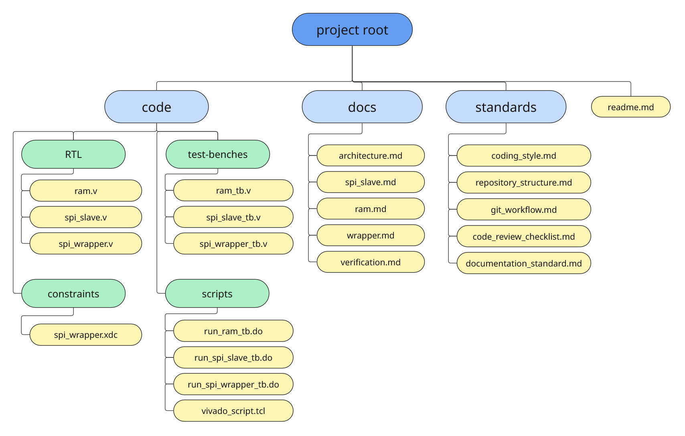

# SPI RAM Project Template

A template repository for learning and experimenting with collaborative RTL development using **Git** and **GitHub**.

The project implements a simple SPI RAM while serving as a sandbox for practicing professional engineering workflows such as branching strategies, Issues, Pull Requests, code reviews, and project documentation.

The workflow and standards developed in this repository are intended to be reused in future, more complex RTL projects.

---

# Objectives

This repository serves as a platform to:

- Develop and verify a simple SPI RAM design.
- Learn collaborative development using Git and GitHub.
- Practice using Issues, feature branches, Pull Requests, and code reviews.
- Experiment with coding, documentation, and repository standards.
- Establish a workflow that can later be reused in larger RTL projects.

---

# Repository Structure



```
SPI_RAM_Project/
│
├── code/
│   ├── RTL/
│   ├── constraints/
│   ├── scripts/
│   │   └── waveforms/
│   └── testbenches/
│
├── docs/
├── standards/
├── questa_projects/
│
├── .gitignore
└── README.md
```

---

# Getting Started

1. Fork this repository.
2. Rename your fork using your **team name** and **project name**.

Example repository names:

```
team_alpha_spi_ram
team_5_spi_ram
digital_design_spi_ram
```

3. Add your teammates as collaborators.
4. Clone your repository locally.
5. Read the standards located in the `standards/` directory.
6. Create your first GitHub Issue.
7. Begin development following the project's Git workflow.

---

# Repository Navigation

| Directory                | Description                                                |
| ------------------------ | ---------------------------------------------------------- |
| `code/RTL`               | Synthesizable Verilog modules                              |
| `code/testbenches`       | Simulation testbenches                                     |
| `code/constraints`       | FPGA constraint files                                      |
| `code/scripts`           | Simulation scripts and development utilities               |
| `code/scripts/waveforms` | QuestaSim waveform configuration files                     |
| `docs`                   | Project and module documentation                           |
| `standards`              | Coding, documentation, and collaboration standards         |
| `questa_projects`        | Local QuestaSim/Questa Lint project files (ignored by Git) |

---

# Development Workflow

Every contribution should follow the workflow below.

```
Fork Repository
        │
        ▼
Rename Repository
        │
        ▼
Invite Collaborators
        │
        ▼
Create Issue
        │
        ▼
Create Feature Branch
        │
        ▼
Implementation
        │
        ▼
Local Verification
        │
        ▼
Open Pull Request
        │
        ▼
Code Review
        │
        ▼
Merge
```

Detailed workflow instructions can be found in:

- `standards/git_workflow.md`

---

# Project Standards

All contributors are expected to follow the standards defined in the `standards/` directory.

Current standards include:

- Coding Style
- Git Workflow
- Code Review Checklist
- Documentation Standards
- Repository Structure

---

# Documentation

Documentation for each RTL module is located in the `docs/` directory.

Documentation should describe:

- The purpose of the module.
- The module interface.
- Internal operation.
- Module usage.
- Important notes or limitations.

Documentation should be updated whenever the RTL changes.

---

# Contributing

Before opening a Pull Request, ensure that:

- Your implementation satisfies the assigned Issue.
- Your RTL follows the project's coding standards.
- Local verification has been completed.
- Documentation has been updated if required.

---

# Future Direction

The primary goal of this repository is to establish a reliable and repeatable collaborative development workflow.

Once the team is comfortable with this workflow, the same engineering practices can be applied to larger RTL projects such as Ethernet, PCIe, MIPI CSI-2, CXL, and other complex digital designs.
